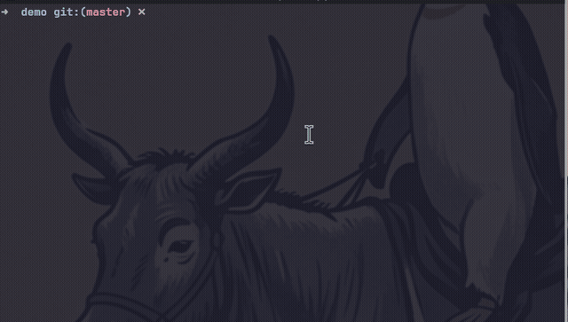

# sandbox-bwrap-nix

[](https://github.com/grigio/sandbox-bwrap-nix/actions/workflows/sandbox.yml)
[](https://github.com/grigio/sandbox-bwrap-nix)
[](https://github.com/grigio/sandbox-bwrap-nix)

Super simple, fast and effective sandbox to run commands in a lightweight bubblewrap + nix sandbox. No docker/podman containers needed

It's useful to run AI agent harness like `opencode` isolated from the main system and you can also install packages as normal user without mess the host system.

Isolates Nix operations from your host filesystem while preserving access to `/nix/store` and `/nix/var/nix`. Useful for safely experimenting with Nix builds, running [OpenCode](https://opencode.ai) in a sandbox, or containing AI coding tools.

## Quick start

```bash
./start-sandbox.sh
```

This drops you into a sandboxed bash shell with Nix, git, bun, uv, jcode, and other tools pre-installed. The sandbox-home directory acts as `$HOME`.



## Installation

Add a persistent alias to your shell config (e.g. `~/.bashrc` or `~/.zshrc`):

```bash
alias sss=/path/to/sandbox-bwrap-nix/start-sandbox.sh
```

Replace `/path/to/sandbox-bwrap-nix` with the absolute path to this directory (use `pwd` to get it). After adding the line, reload with `source ~/.bashrc` (or open a new terminal), then launch with `sss`.

### Example usage

```
➜  demo git:(master) ✗ ls ../
-               examples      ggml.h            main           rec.wav
bench           extra         ggml-metal.h      Makefile       run.sh
bindings        ggml-alloc.c  ggml-metal.m      models         samples
build           ggml-alloc.h  ggml-metal.metal  openvino       stream
cmake           ggml-alloc.o  ggml.o            quantize       tests
CMakeLists.txt  ggml.c        ggml-opencl.cpp   README.md      whisper.cpp
coreml          ggml-cuda.cu  ggml-opencl.h     rec16.wav      whisper.h
demo            ggml-cuda.h   LICENSE           rec16.wav.wts  whisper.o
➜  demo git:(master) ✗ sss ls ../
=== sandbox-bwrap-nix development shell ===
  nixpkgs: nixpkgs-unstable (commit 7525d99)
  tools: nix, git, bun, curl, uv, make, opencode
demo
➜  demo git:(master) ✗ opencode --version
1.18.4
➜  demo git:(master) ✗ sss opencode --version
=== sandbox-bwrap-nix development shell ===
  nixpkgs: nixpkgs-unstable (commit 7525d99)
  tools: nix, git, bun, curl, uv, make, opencode
1.18.3
➜  demo git:(master) ✗ sss
=== sandbox-bwrap-nix development shell ===
  nixpkgs: nixpkgs-unstable (commit 7525d99)
  tools: nix, git, bun, curl, uv, make, opencode
● demo $ ls ../
demo
```

## How it works

[`start-sandbox.sh`](start-sandbox.sh) invokes `bwrap` with:

| Mount | Type | Purpose |
|-------|------|---------|
| `/nix/store`, `/nix/var/nix` | bind (ro) | Nix store access |
| `/nix/var/nix/builds` | tmpfs | Isolate builds |
| `/bin/sh`, `/bin/bash`, `/usr/bin/nix` | bind (ro) | Essential binaries |
| `/usr/lib`, `/usr/lib64` | bind | Shared libraries |
| `/etc/resolv.conf`, `/etc/hosts`, `/etc/nsswitch.conf` | bind (ro) | DNS / name resolution |
| SSL certs | bind (ro) | HTTPS support |
| `sandbox-home/` | bind | Isolated home dir |
| `/tmp` | tmpfs | Temporary files |
| `/proc` | procfs | Process access |
| `/dev` | tmpfs + device binds + fresh devpts | Only `null/zero/full/random/urandom/tty` bound from host; pty support via a fresh devpts instance mounted inside (`ptmxmode=666`, `/dev/ptmx` → `pts/ptmx`), with the dev shell run under `script(1)` so it gets a pty from that instance |

The environment is cleared (`--clearenv`), networking is shared (`--share-net`), and PID namespace is unshared (`--unshare-pid`).

Inside the sandbox, `nix develop` with the [flake](flake.nix) provisions a dev shell containing: **nix, git, bun, uv, jcode, opencode, gnumake, micro, less**, and bash completion.

## Why bwrap instead of plain `nix develop`

| Aspect | `nix develop` alone | `bwrap` + `nix develop` |
|--------|-------------------|------------------------|
| **Filesystem** | Full host access | Only explicitly bound paths visible |
| **Environment** | Inherits all host vars | `--clearenv` gives a clean slate |
| **Process isolation** | Shares host PID namespace | `--unshare-pid` hides host processes |
| **Home directory** | Real `$HOME` | Isolated `sandbox-home/` |
| **Security** | AI tools can read/write any file | Accidental `rm -rf` stays contained |
| **Reproducibility** | Host state leaks in | Minimal, controlled surface |

bwrap is also lighter than containers — no daemon, no image pulls, no layers, no `sudo`. Just namespaces and bind mounts.

## jcode: prebuilt binary, no compilation

[jcode](https://github.com/1jehuang/jcode) is provided as a prebuilt binary from the
[grigio Nix binary cache](https://grigio.github.io/jcode)
(install docs: <https://github.com/grigio/jcode#install-flake>). It is never compiled in
this repo: the cache publishes both the `jcode` binary and its crane `cargoArtifacts`
dependency layer, so `nix develop` only downloads the closure.

The cache is configured in two places:

- `nixConfig` in [`flake.nix`](flake.nix) — applies to every `nix develop`, `nix build`
  and `nix flake check` run in this repo
- `sandbox-home/.config/nix/nix.conf` — the Nix config inside the sandbox (Nix runs with
  `HOME=sandbox-home`, so it reads this file)

Paths the cache does not have fall back to building from source. The grigio
cache only publishes **x86_64-linux**, so on that platform jcode is a pure
download; on other systems (e.g. aarch64-linux) the dev shell simply omits
jcode instead of compiling it from source.

## Requirements

- Linux with [bubblewrap](https://github.com/containers/bubblewrap) (`bwrap`) installed
- Nix with flakes and `nix-command` enabled on the host

## Project structure

```
├── start-sandbox.sh        # Entry point — invokes bwrap
├── flake.nix               # Nix flake with dev shell definition
├── flake.lock              # Pinned nixpkgs revision
├── badges/                 # Version badge data (opencode, jcode), updated by CI
├── .github/workflows/      # GitHub Actions: version badge updater
├── sandbox-home/           # Isolated home directory
│   ├── .bashrc             # Colored prompt, git branch, aliases
│   ├── .bash_profile       # Sources .bashrc
│   ├── SANDBOX             # Marker file (empty)
│   └── .config/
│       ├── nix/nix.conf    # Enables flakes + nix-command + jcode binary cache
│       └── opencode/       # OpenCode config (skills, AGENTS.md)
├── .gitignore              # Ignores generated runtime artifacts
├── LICENSE                 # MIT License
└── README.md
```

## sandbox-home

A minimal home directory injected into the sandbox:

- **`.bashrc`** — Custom PS1 with working directory and git branch, bash completion from the Nix store, colorized grep, `ll`/`la`/`l` aliases
- **`nix.conf`** — `experimental-features = nix-command flakes`, plus the grigio jcode binary cache substituter and trust key
- **`opencode/`** — Pre-configured with skills, AGENTS.md prompt instructions, and an opencode.jsonc config
- Runtime caches (`.cache`, `.npm`, `.local`, `.nix-profile`, etc.) are gitignored

## Adding tools to the sandbox

Edit [`flake.nix`](flake.nix) and add packages to the `mkShell` `packages` list, then run:

```bash
nix flake update    # update nixpkgs (optional)
```

## Updating nixpkgs

```bash
nix flake update
```

This updates `flake.lock` to the latest nixpkgs unstable commit.

## License

MIT — see [LICENSE](LICENSE).
